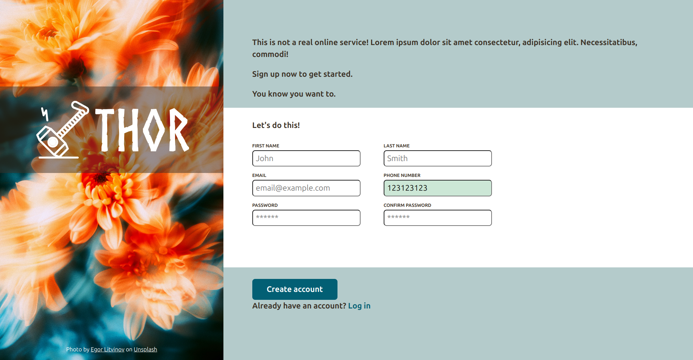

# Sign Up Form

A simple sign up form project built with HTML and CSS, created as part of The Odin Project's Intermediate HTML and CSS curriculum.

## Description

This project is a basic implementation of a sign up form, demonstrating the use of HTML and CSS to create a responsive and visually appealing form.

## Features

* Responsive design for a smooth user experience
* Basic styling with a modern aesthetic
* Form validation using HTML5 attributes

## Demo

[**Live Demo**](https://radix-ratio.github.io/sign-up-form/) | [**Project Specs**](https://www.theodinproject.com/lessons/node-path-intermediate-html-and-css-sign-up-form#project-solution)

## Screenshots

## Getting Started

1. Clone the repository to your local machine.
2. Open the `index.html` file in a web browser to view the form.

## License

This project is licensed under the MIT License. See [`LICENSE`](https://choosealicense.com/licenses/mit/) for details.

## Acknowledgments

- The Odin Project for providing the curriculum and resources

## Authors

- [radix-ratio](https://www.github.com/radix-ratio)